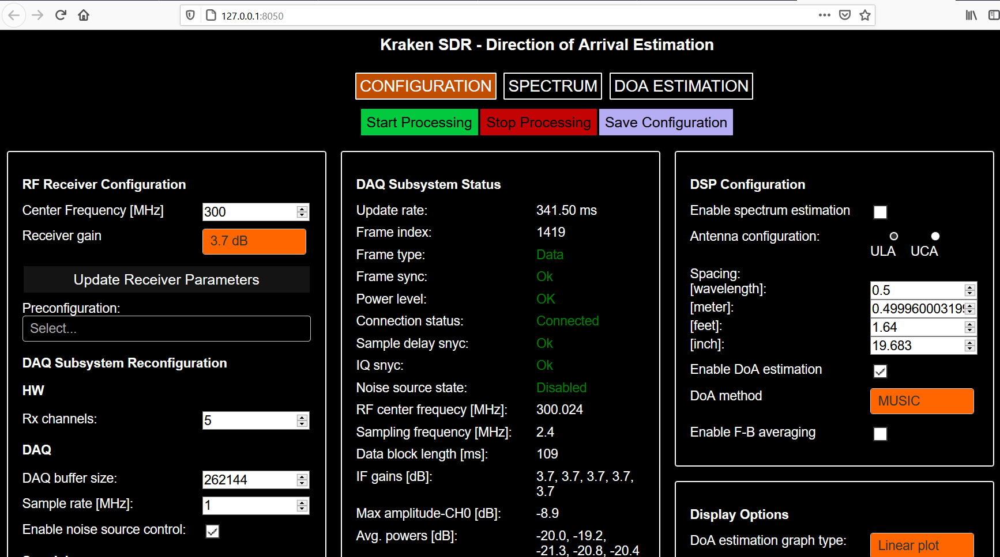

# Kraken SDR DoA DSP
This software is intended to demonstrate the direction of arrival (DoA) estimation capabilities of the KrakenSDR and other RTL-SDR based coherent receiver systems which use the compatible data acquisition system - HeIMDALL DAQ Firmware.

The complete application is broken down into two main modules in terms of implementation, into the DAQ Subsystem and to the DSP Subsystem. These two modules can operate together either remotely through Ethernet connection or locally on the same host using shared-memory.

Running these two subsystems on separate processing units can grant higher throughput and stability, while running on the same processing unit makes the entire system more compact.

## Pi 4 Image QUICKSTART (KerberosSDR, or beta KrakenSDR Testers)

We have a beta Pi 4 SD card image available here **https://drive.google.com/file/d/1JT41DfkaYNSgGlxqaAvUwHQO_NwXewRW/view?usp=sharing**. In this image the code will automatically run on boot. Note that it may take 2-3 minutes for the boot process to complete. 

To run this code flash the image file to an 8GB or larger SD Card using Etcher. For advanced users the login/password details for SSH and terminal are "krakenrf"/"krakensdr"

### Choose and Set up Connectivity Option 
In this image there are three ways to connect to the web GUI interface.

1) **Pi 4 WiFi Hotspot:** If you simply boot up the image without setting up options 2 or 3, then the Pi 4 will automatically create a WiFi hotspot with SSID name "krakensdr" that you can connect to. The SSID password is also "krakensdr". Once connected, you can use a web brower to browse to "http://192.168.50.5:8080", which will load up the web interface.

Note that if you use this method, your mobile device will not have any internet access. So if you are using the Android App, be sure to download offline maps first.

2) **AndroidWiFi  Mobile Hotspot:** In this method you use your Android device to set up a WiFi mobile 4G/5G hotspot with SSID/password "KrakenAndroid"/"KrakenAndroid". The setup procedure is different on every phone, but it's usually under a setting called "Mobile Hotspot". When the Pi 4 boots up the image, if the KrakenAndroid SSID is detected, the Pi4 will automatically connect to the KrakenAndroid SSID. With this method your mobile device will retain full mobile internet access, allowing the KrakenSDR Android App to download maps as you drive.

To connect to the web interface you will need to determine the IP address given to the KrakenSDR. You can find this in the mobile hotspot settings too. Again this is different on every Android device, so you'll need to determine this yourself for your own device.

If the KrakenAndroid SSID is not detected, the Pi 4 will automatically revert to option 1, and create it's own hotspot without internet.

3) **Connect to your own WiFi Network** If you are running the KrakenSDR at a fixed location, it makes sense to connect to your home/facilities WiFi network. There are two ways to do this. 
a) Either connect a monitor, and etc `sudo nano /etc/wpa_supplicant/wpa_supplicant.conf` in terminal. In the entry where it says "MY_SSID" and "MY_SSID_PASSWORD" enter your own WiFi information there. If you are outside the USA, make sure to set your two letter country code on the top line too. Then press "CTRL+X", "Y", to save and exit.
b) Add a wpa_supplicant.conf file in the boot drive of the image. You can do this by connecting your SD Card to a Windows machine, and opening up the boot drive that can be seen. In the boot drive we've left a file called "wpa_supplicant_example.conf". Make a copy of this file in the same directory, and rename it to "wpa_supplicant.conf". Now edit wpa_supplicant.conf with Notepad, replacing "MY_SSID" and "MY_SSID_PASSWORD" with your own WiFi information. If you are outside the USA, make sure to set your two letter country code on the top line too. Save this file.

Now after performing either method a) or b) when you reboot the Pi 4 should automatically connect to your home WiFi. If the KrakenAndroid WiFi is present, priority will be given to that connection first, so be sure to turn your hotspot off if you want to connect to the fixed WiFi network.

With this method you can then browse to http://krakensdr:8080 to load up the web interface.

### KerberosSDR BOOTING NOTE
The Pi 4 hardware has a problem where it will not boot if a powered USB hub drawing current from the Pi 4 is plugged in. Inside the KerberosSDR is a powered USB hub and hence the Pi 4 will not boot if the KerberosSDR is plugged in. So please plug the KerberosSDR in after booting. For the KrakenSDR the hardware implementation forces external power only, so this problem does not occurr. If this is a problem for your particular KerberosSDR setup, you can force external power only on the KerberosSDR by opening the enclosure and removing the `JP2` jumper

### KerberosSDR EEPROM Update
For KerberosSDR users you will need to initially flash the EEPROM to use the new serial numbering scheme. There is a script in `krakensdr/heimdall_daq_fw/util/eeprom_init.sh` that can guide your through this. Just plug in your KerberosSDR (ensuring it is powered from the power port), and run the script `./eeprom_init.sh`. The script will guide you to use the DIP switches to turn all units off, except the currently requested tuner. It will then flash the realtek_oem firmware, then the serial number, before asking you to turn off that tuner, and turn on the next one. Answer `Y` each time it asks to flash.

Once the EEPROM is flashed you can run the code.

### KerberosSDR Reconfiguration
The image is currently set up for the KrakenSDR. For KerberosSDR users, please update the EEPROM as described above first, then reboot. Once the web interface is loaded, expand the "Basic DAQ Settings" by clicking on the checkbox. Under "Preconfigured DAQ Files" select "kerberosSDR_default", and then click on "Reconfigure and Restart DAQ chain". This may take a minute or so, but after it's completed the software should connect and begin processing.

### KerberosSDR
The KrakenSDR code base is designed to autocalibrate phase on each retune. Unfortunately this feature is not available on the KerberosSDR due to the lack of a noise source switching circuit. So with the KerberosSDR every time you change the frequency or DAQ settings, make sure that you have the antennas disconnected. Also if you make any custom changes to the DAQ settings (which is not recommended), always ensure that `Calibration Track Mode` is set to `No Tracking` otherwise the software will attempt to recalibrate every X-minutes.

Once you've set the frequency, you can connect your antennas. Then click on the `Spectrum` tab. Ensure that the signal is there, and is not overloading. If it looks like the spectrum is overloaded, reduce the gain. Take note of an appropriate squelching threshold for the signal.

## Pi 3 Users (NOT RECOMMENDED)

The image recommended for use and is tested for the Pi 4 only. We strongly recommend using a Pi 4. The Pi 3 can also be used in a pinch, though it will run the code much slower and it may not be fast enough to process fast bursty signals. The initial code run numba JIT compiles will take several minutes as well (first time you click start or enable the squelch), and the spectrum display may lag. To convert the Pi 4 image to a Pi 3 install, you will need to recompile the NE10 ARM DSP library and the Heimdall C DAQ files for the Pi 3 CPU first however. 

As the Pi 3 very quickly thermal throttles, we recommend adding a good heatsink and fan and installing cpufrequtils `sudo apt install cpufrequtils`, and in `~/krakensdr/heimdall_daq_fw/Firmware/daq_start_sm.sh` uncomment `#sudo cpufreq-set -g performance`.

Follow the steps above for the Pi 4, but before you run the code you'll need to recompile for the Pi 3 CPU by following the steps in the `Heimdall README` for the `NE10` and `Heimdall Manual Install Compile Instructions`, BUT use the following commands instead:

For the NE10 compile, enter the build folder and run:

``` bash
cmake -DNE10_LINUX_TARGET_ARCH=aarch64 -DGNULINUX_PLATFORM=ON -DCMAKE_C_FLAGS="-mcpu=cortex-a53 -mtune=cortex-a53 -Ofast -funsafe-math-optimizations" ..
make
```

Then copy the new `libNE10.a` library over.

``` bash
cd ~/krakensdr/heimdall_daq_fw/Firmware/_daq_core/
cp ~/Ne10/build/modules/libNE10.a .
```

Next edit the `_daq_core` `Makefile` and optimize it for the Pi 3.

``` bash
nano Makefile
```

Change the `CFLAGS` line to the following:

```CFLAGS=-Wall -std=gnu99 -mcpu=cortex-a53 -mtune=cortex-a53 -Ofast -funsafe-math-optimizations -funroll-loops```

`Ctrl+X`, `Y` to save

Then run `make` to recompile `heimdall`.

Now you can run the code as normal on the Pi 3.

## Manual Installation from a fresh OS

1. Install the prerequisites

``` bash
sudo apt update
sudo apt install php-cli nodejs
```

2. Install Heimdall DAQ

If not done already, first, follow the instructions at https://github.com/krakenrf/heimdall_daq_fw/tree/development to install the Heimdall DAQ Firmware.

3. Set up Miniconda environment

You will have created a Miniconda environment during the Heimdall DAQ install phase.

Please run the installs in this order as we need to ensure a specific version of dash and Werkzeug is installed because newer versions break compatibility with other libraries.

``` bash
conda activate kraken

conda install quart
conda install pandas
conda install orjson
conda install matplotlib
conda install requests

pip3 install dash_bootstrap_components
pip3 install quart_compress
pip3 install dash_devices
pip3 install pyargus

conda install dash==1.20.0
conda install werkzeug==2.0.2
```

4. Install the `krakensdr_doa` software

```bash
cd ~/krakensdr
git clone https://github.com/krakenrf/krakensdr_doa
```

Copy the the `krakensdr_doa/util/kraken_doa_start.sh` and the `krakensdr_doa/util/kraken_doa_stop.sh` scripts into the krakensdr root folder of the project.
```bash
cp krakensdr_doa/util/kraken_doa_start.sh .
cp krakensdr_doa/util/kraken_doa_stop.sh .
```

## Running

### Local operation (Recommended)

```bash
./kraken_doa_start.sh
```

Please be patient on the first run, at it can take 1-2 minutes for the JIT numba compiler to compile the numba optimized functions, and during this compilation time it may appear that the software has gotten stuck. On subsqeuent runs this loading time will be much faster as it will read from cache.

### Remote operation

*UNTESTED*

1. Start the DAQ Subsystem either remotely. (Make sure that the `daq_chain_config.ini` contains the proper configuration) 
    (See:https://github.com/krakenrf/heimdall_daq_fw/Documentation)
2. Set the IP address of the DAQ Subsystem in the `settings.json`, `default_ip` field.
3. Start the DoA DSP software by typing:
`./gui_run.sh`
4. To stop the server and the DSP processing chain run the following script:
`./kill.sh`

After starting the script a web based server opens at port number `8080`, which then can be accessed by typing `KRAKEN_IP:8080/` in the address bar of any web browser. You can find the IP address of the KrakenSDR Pi4 wither via your routers WiFi management page, or by typing `ip addr` into the terminal. You can also use the hostname of the Pi4 in place of the IP address, but this only works on local networks, and not the internet, or mobile hotspot networks.

  

## Upcoming Features and Known Bugs

~~1. [FEATURE] Currently squelch works by selecting the strongest signal that is active and above the set threshold within the active bandwidth. The next steps will be to allow users to create multiple channels within the active bandwidth, each with their own squelch. This will allow users to track multiple signals at once, and ignore unwated signals within the bandwidth at the same time.~~

2. [FEATURE] It would be better if the KrakenSDR controls, spectrum and/or DOA graphs could be accessible from the same page. Future work will look to integrate the controls in a sidebar.

~~3. [FEATURE] Some users would like to monitor the spectrum, and manually click on an active signal to DF that particular signal. We will be looking at a way to implement this.~~

~~4. [BUG] Sometimes the DOA graphs will not load properly and refreshing the page is required. A fix is being investigated.~~

5. [FEATURE] ALL VFO output for Kraken Pro App JSON format does not yet work. When the Kraken Pro App is released and supports this it will be added.  

~~6. [MULTI-CHANNEL/CLICK TO TUNE NOTES]. Note, if you use these features, you must use the fractional compensation delay feature branch of heimdall, otherwise the DoA data will be corrupt for non-centered signals.~~

This software was 95% developed by Tamas Peto, and makes use of his pyAPRIL and pyARGUS libraries. See his website at www.tamaspeto.com
